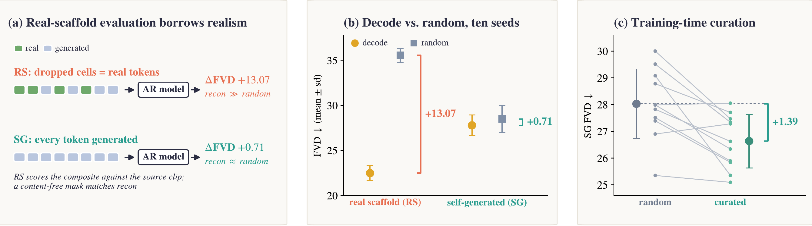

<h1 align="center">Borrowed Realism: Ground-Truth Leakage in Token-Curated Autoregressive Video Generation</h1>

<p align="center">🎉 <b>Accepted at ACCV 2026</b> (Asian Conference on Computer Vision) 🎉</p>

<br>

<p align="center">
Nirmal Adhikari<sup>1</sup> &nbsp;·&nbsp; Dohhoon Kim<sup>1</sup> &nbsp;·&nbsp; Chingiz Tursunbaev<sup>1</sup> &nbsp;·&nbsp; Ahyun Kim<sup>1</sup>
<br>
John Heong Lee<sup>1</sup> &nbsp;·&nbsp; <a href="https://github.com/nirvikagupta">Nirvika Gupta</a><sup>2</sup> &nbsp;·&nbsp; Wookey Lee<sup>1⋆</sup>
</p>

<p align="center">
<sup>1</sup> Inha University, Incheon, Republic of Korea
<br>
<sup>2</sup> Indraprastha Institute of Information Technology Delhi, New Delhi, India
<br><br>
<sup>⋆</sup> Corresponding author: <a href="mailto:trinity@inha.ac.kr">trinity@inha.ac.kr</a>
</p>

<br>

---

<br>



## In plain words

AI video generators build a video piece by piece. A popular way to make them faster is to generate only the details
that some rule marks as important and fill in everything else from a rough, low-resolution sketch.

A convenient way to compare such rules is to give the generator a rough sketch taken from a **real** video and score
the result against that same video. In a controlled study, we show that this test can reward the real content the
output borrows rather than the rule: on it, even a fixed mask that never looks at the video does as well as the top
rule.

When the generator draws its own sketch, as it must in real use, the top rule's lead over random choice shrinks from
**13.07 to 0.71 FVD** (lower FVD = more realistic video), too small to tell apart from zero. The lesson: judge these
speed-ups on fully self-generated videos.

## Highlights

- A controlled study of eleven token-selection setups, ten training seeds, three video tokenizers and two video datasets.
- Controlled tests on published generators: VAR, RQ-VAE, FastVAR and AdapTok.

## Code

| | |
|---|---|
| `src/` | token extraction, selectors and curated caches, AR model and training, generation in both regimes, FVD |
| `scripts/` | the pipelines that produced the results |
| `external/` | adapters for VAR, RQ-VAE, FastVAR and AdapTok |
| `configs/` | training arguments of every run (`runs.json`), generation batch sizes |

The two evaluation regimes are `src/ar_generate.py --mode packed` (real scaffold) and
`--mode packed_gencoarse_ref` (self-generated scaffold).

## Usage

The pipelines need Kinetics-400, the tokenizer checkpoints (paths: `src/paths.py`) and GPUs.

```bash
pip install -r requirements.txt
bash scripts/core/00_extract.sh k400 && bash scripts/core/01_selectors.sh A   # tokens and curated caches
bash scripts/core/10_primary_ten_seeds.sh    # decode, random and learned head; ten seeds; both regimes
```

Other experiments: `scripts/core/1*.sh`, `scripts/controls/` (after `01_k400_prep.sh`).
Published systems: `external/*/README.md`.

## Notes

- Checkpoints, generated videos and features are not included.
- Some pipeline steps were rebuilt from the recorded arguments of the original runs; Cosmos-DV caches are not built here.
- Run names: `255M` is the 351M-parameter model; `67M` is the Cosmos-DV model.

## Acknowledgements

This work builds on the following open-source projects. We thank their authors.

| Project | Used for |
|---|---|
| [OmniTokenizer](https://github.com/FoundationVision/OmniTokenizer) | primary video tokenizer |
| [Cosmos Tokenizer](https://github.com/NVIDIA/Cosmos-Tokenizer) | second video tokenizer (Cosmos-DV) |
| [SEED-Voken (Open-MAGVIT2)](https://github.com/TencentARC/SEED-Voken) | third video tokenizer |
| [VAR](https://github.com/FoundationVision/VAR) | real-prior and pruning test |
| [RQ-VAE Transformer](https://github.com/kakaobrain/rq-vae-transformer) | real-prefix and pruning test |
| [FastVAR](https://github.com/csguoh/FastVAR), [Infinity](https://github.com/FoundationVision/Infinity) | native pruning test |
| [AdapTok](https://github.com/VisionXLab/AdapTok) | adaptive token allocation test |
| [PyTorchVideo](https://github.com/facebookresearch/pytorchvideo) | I3D features for FVD |
| [pytorch-fid](https://github.com/mseitzer/pytorch-fid) | FID |

Datasets: Kinetics-400, Something-Something v2, ImageNet, MJHQ-30K.

## Citation

```bibtex
@inproceedings{adhikari2026borrowed,
  title     = {Borrowed Realism: Ground-Truth Leakage in Token-Curated Autoregressive Video Generation},
  author    = {Adhikari, Nirmal and Kim, Dohhoon and Tursunbaev, Chingiz and Kim, Ahyun and Lee, John Heong and Gupta, Nirvika and Lee, Wookey},
  booktitle = {Asian Conference on Computer Vision (ACCV)},
  year      = {2026}
}
```

## License

MIT (see `LICENSE`). Third-party code, checkpoints and datasets keep their own licenses.
